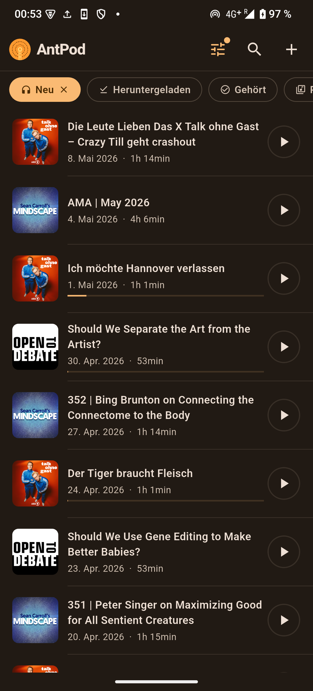
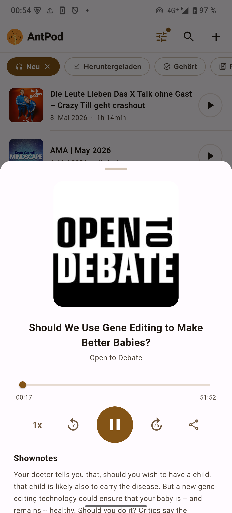
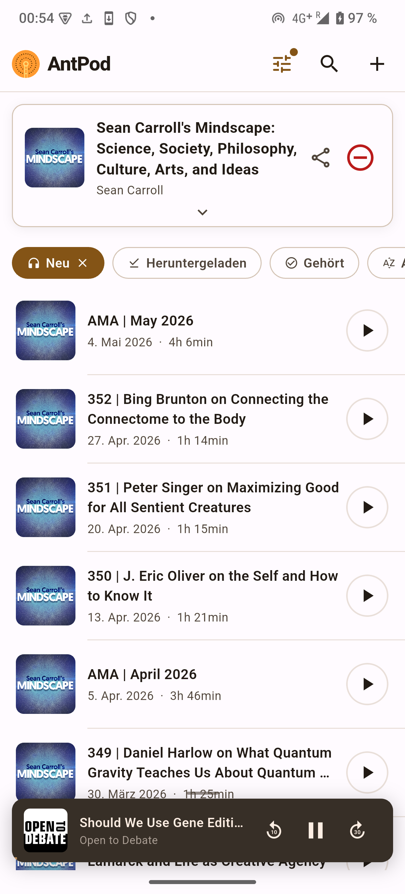

  

# AntPod
**Six legs. Zero ads.**

Open-source podcast app for Android and iOS — built with Flutter, powered by [PodcastIndex](https://podcastindex.org).

Inspired by [AntennaPod](https://antennapod.org) — the dinosaur of FOSS podcast apps — AntPod is the next generation: carries only what it needs and is really pleasant to use.

  

---

  
  
  

---

## Get it

Or build from source — standard `flutter run`.

---

## How to use

→ **[antpod.eu/guide](https://antpod.eu/guide)**

---

## Languages

English · Deutsch · Español · Français

---

**[antpod.eu](https://antpod.eu)**
